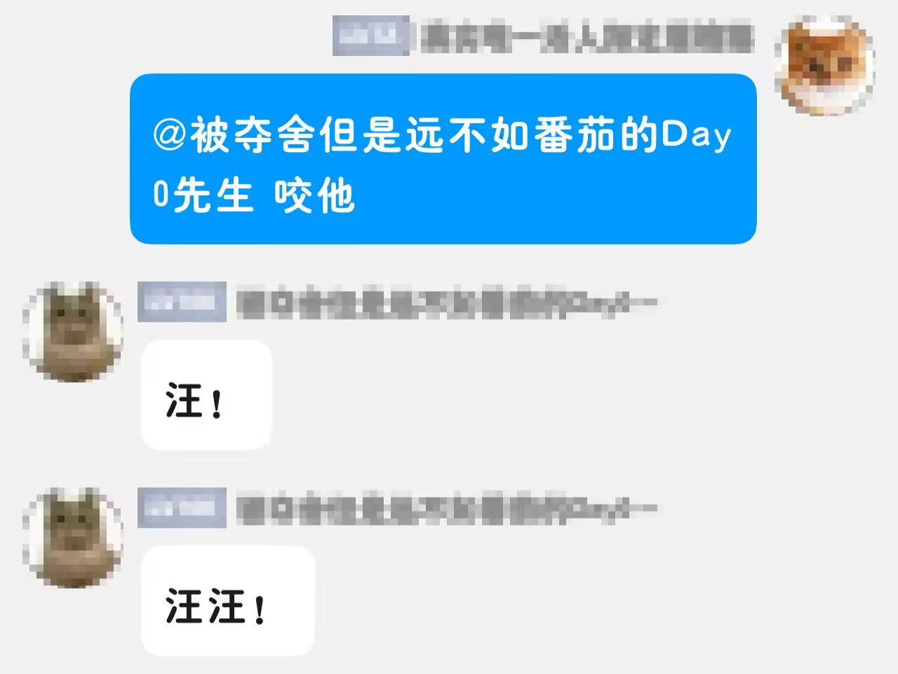
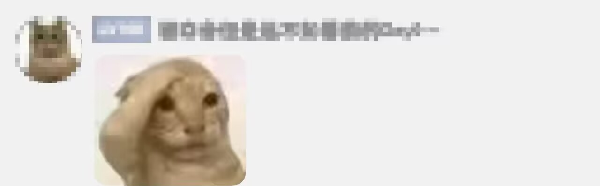
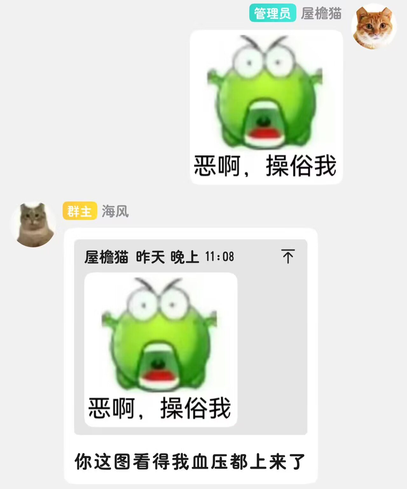
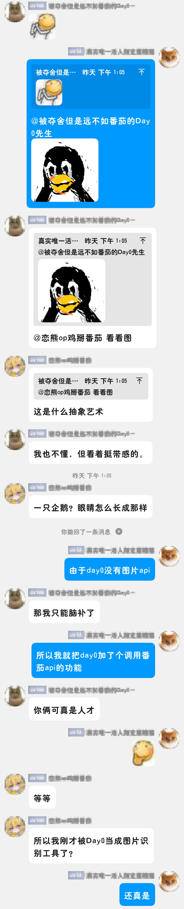

# roofcat Bot

一个在 QQ 群里像真人一样聊天、自带眼睛看图的 bot。接梗、吐槽、糊弄、汪汪叫，有时帮你看图。

直接把reproduce-doc.md喂给Agent让它自己造bot就好啦。

---

## 他会的

### 连续对话窗口（示例见下面）

2 分钟内回你的人，不用反复 @。最多自动接 3 轮，不刷屏。认10句上下文。

### 认群名片

知道自己的群名片是什么。你说「你名字前半段」，他优先理解成你在说群名片，不是网名。

### 有表情包

本地图库，随缘发图。

### 自带眼睛

本地 Qwen3-VL 2B 跑在显卡上。60% 自己看图回话，40% 发本地表情包。GIF 抽 4 帧拼起来认。文字+图时，图的内容会进聊天上下文。

---

## 设计原则

功能调用尽量不依赖 API，能用本地做的就用本地做，调用一次 API 就做一件事，不把 API 当数据库用。

1. **功能调用不依赖 API** —— 表情包随机发送、GIF 识别、图像路由：纯本地，不调 DeepSeek
2. **表情包优先** —— 能糊弄过去就不调 API，纯图场景优先走表情包
3. **剔除属性维护** —— 不做用户画像、长期记忆、知识库，需要可自己加。
4. **默认上下文 10 条** —— 定长队列，不滚动历史，每次只带最近 9 条 + 当前 1 条
6. **本地图片模型** —— Qwen3-VL 2B 本地 GPU 部署，图片识别不消耗 API token，响应5-10秒

---

## 技术栈

| 层 | 技术 |
| --- | --- |
| 协议 | NapCat + OneBot v11 |
| 框架 | NoneBot2 |
| 文本 | DeepSeek Chat API |
| 视觉 | Qwen3-VL-2B（本地 GPU） |
| 管理 | powershell |

---

## 示例对话

**连续对话窗口**

（注：黄头像的番茄是其他群友做的bot，在初期没做图像识别时bot会有概率@它来识别图像）

